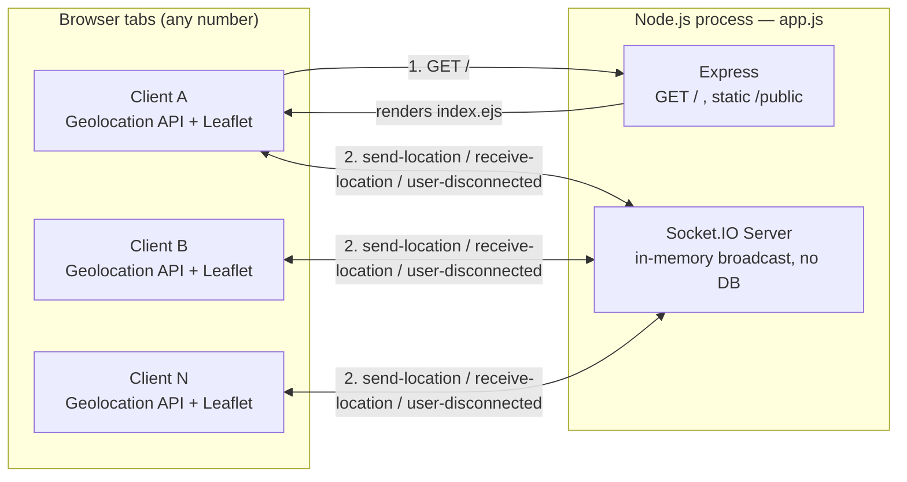
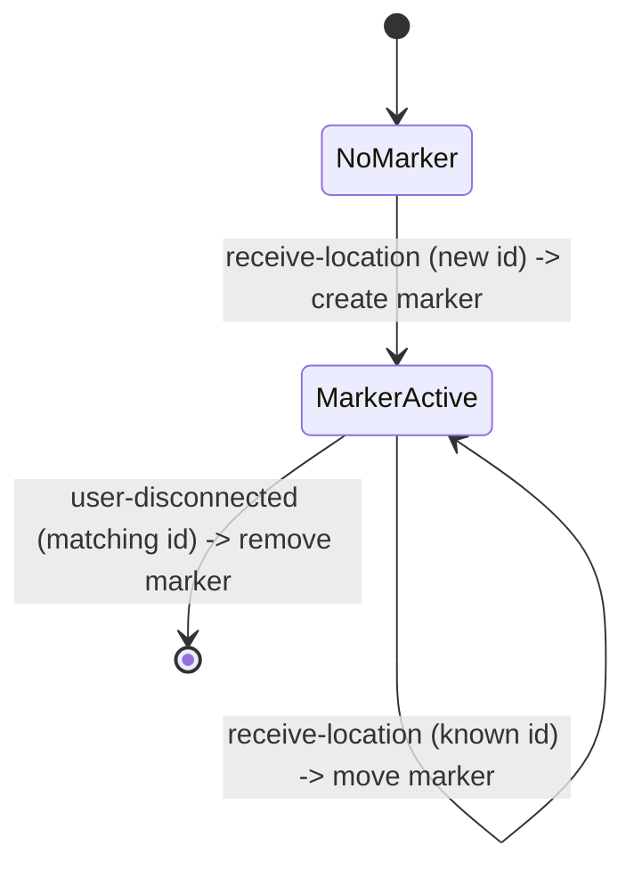

# Product Requirements Document: Navora

**Real-Time Location Sharing Web App**

| | |
|---|---|
| **Document status** | Draft — reverse-engineered from the current codebase, plus forward-looking requirements |
| **Version** | 1.0 |
| **Last updated** | August 28, 2026 |
| **Owner** | Project maintainer |

> **How to read this document:** Sections 1–6 describe the product's purpose and scope. Section 7 onward defines requirements — each is marked **Implemented** (already true of the shipped code), **Partially Implemented** (built, but with a bug or gap), or **Proposed** (not yet built). This lets the PRD double as both a specification and a snapshot of where the current build stands against it.

## Table of Contents

- [1. Purpose](#1-purpose)
- [2. Problem Statement](#2-problem-statement)
- [3. Goals and Success Metrics](#3-goals-and-success-metrics)
- [4. Target Users / Personas](#4-target-users--personas)
- [5. Scope](#5-scope)
- [6. System Architecture](#6-system-architecture)
- [7. Functional Requirements](#7-functional-requirements)
- [8. Event / Data Contracts](#8-event--data-contracts)
- [9. Non-Functional Requirements](#9-non-functional-requirements)
- [10. UX Requirements](#10-ux-requirements)
- [11. User Stories](#11-user-stories)
- [12. Known Gaps vs. This Spec](#12-known-gaps-vs-this-spec)
- [13. Risks and Mitigations](#13-risks-and-mitigations)
- [14. Assumptions and Constraints](#14-assumptions-and-constraints)
- [15. Release Plan](#15-release-plan)
- [16. Future Enhancements](#16-future-enhancements)
- [17. Glossary](#17-glossary)

## 1. Purpose

Navora is a browser-based, real-time location-sharing tool. A user opens a URL, grants location permission, and immediately becomes a live marker on a map shared with everyone else who has the same page open. There is no account creation, no app install, and no persistent storage — the product's value is instant, frictionless, ephemeral location visibility for a group.

This document defines what Navora is meant to do (current MVP), how it currently behaves, and what's required to take it from a working proof of concept to a production-ready feature.

## 2. Problem Statement

People frequently need to share their live location with a small group temporarily — coordinating a meetup, tracking a group hike or road trip, or keeping family updated while traveling — without committing to a platform-specific app, an account, or a service that retains their location history indefinitely. Existing solutions (native "Find My" apps, chat-app live location, mapping-app sharing links) are typically tied to a specific ecosystem or app the recipient must also use. Navora's goal is to make this a link you open in any browser: grant permission once, and everyone with the link sees everyone else, with nothing left behind once the session ends.

## 3. Goals and Success Metrics

| Goal | Target metric (proposed — not yet instrumented) |
|---|---|
| Frictionless entry | Time from opening the link to appearing on the map < 5 seconds (including the permission prompt) |
| Real-time accuracy | Marker position updates reflected on other clients within ~1 second of a location change, under normal network conditions |
| Reliability | A disconnected user's marker is removed from all other clients within one broadcast cycle |
| Lightweight footprint | Server remains a single Node process with no required database for the core sharing feature |

> **Note:** the current codebase has no analytics, logging of latency, or usage tracking, so these are target metrics to instrument against, not measured results.

## 4. Target Users / Personas

- **The Organizer** — planning a group meetup, event, or outing, and wants to see where everyone in the group currently is on one map.
- **The Traveler** — wants to share their live location with one or two family members or friends while away from home.
- **The Developer** — evaluating or extending this repository as a minimal reference implementation of a Socket.IO + Leaflet real-time location feature.

## 5. Scope

### 5.1 In scope (current MVP)

- A single shared map page, served to any browser that requests it.
- Real-time, bidirectional location broadcast between all connected clients via Socket.IO.
- Marker creation, movement, and removal driven entirely by socket connection lifecycle (connect → send-location → disconnect).

### 5.2 Out of scope (current MVP)

- User accounts, login, or authentication of any kind.
- Multiple independent rooms or sessions (all connected clients currently share one global map).
- Persistent storage of any location data.
- Native mobile apps.
- Access control, invite links, or private/scoped sharing.

## 6. System Architecture

Navora is a single Node.js process running an Express app and a Socket.IO server on the same HTTP server instance. Express serves the page and static assets; Socket.IO handles all real-time communication. There is no database layer — all "state" (who is connected, and where they last reported being) lives only in memory, scoped to active socket connections.

**Marker lifecycle on each client**, driven purely by socket events:

## 7. Functional Requirements

| ID | Requirement | Priority | Status |
|---|---|---|---|
| FR-1 | The system shall request the browser's geolocation permission when the page loads. | Must | **Implemented** |
| FR-2 | The system shall continuously stream the user's coordinates to the server whenever the position changes, using `watchPosition`. | Must | **Partially Implemented** — works, but the intended accuracy/timeout options are not actually being passed to the API (see [Section 12](#12-known-gaps-vs-this-spec)). |
| FR-3 | The server shall broadcast every received location, tagged with the sender's connection id, to all connected clients. | Must | **Implemented** |
| FR-4 | The client shall render exactly one marker per unique connected user, updating its position on subsequent updates instead of creating duplicates. | Must | **Implemented** |
| FR-5 | When a client disconnects, all remaining clients shall remove that user's marker. | Must | **Implemented** |
| FR-6 | The system shall serve a single web page with the map UI and its static assets (CSS/JS) over HTTP. | Must | **Implemented** |
| FR-7 | The map view should stay centered on the local user's own position, not jump to whichever peer's update last arrived. | Should | **Not implemented** — current behavior recenters on every incoming update from any user. |
| FR-8 | The system should support multiple independent rooms/sessions so sharing can be scoped to a specific group rather than global. | Should | **Proposed** |
| FR-9 | Each connected user should be able to set a display name and/or color shown with their marker. | Should | **Proposed** |
| FR-10 | The server port and other runtime settings should be configurable via environment variables. | Should | **Proposed** (currently hardcoded to `3000`) |
| FR-11 | The system could persist last-known locations so a page refresh or brief reconnect doesn't immediately drop a user's marker for everyone else. | Could | **Proposed** |
| FR-12 | The system could show a simple recent-path/trail per user rather than just the latest point. | Could | **Proposed** |

## 8. Event / Data Contracts

All real-time communication happens over Socket.IO events on the connection established when a client loads the page.

| Event | Direction | Payload shape | Notes |
|---|---|---|---|
| `send-location` | client → server | `{ latitude: number, longitude: number }` | Sent on every `watchPosition` update. |
| `receive-location` | server → all clients | `{ id: string, latitude: number, longitude: number }` | `id` is the sender's `socket.id`; echoed back to the sender as well as everyone else. |
| `disconnect` | client → server (built-in) | — | Standard Socket.IO lifecycle event. |
| `user-disconnected` | server → remaining clients | `id: string` | Instructs clients to remove the marker for this id. |

**Proposed additions** (not yet part of the contract): a `room`/session identifier on `send-location` and `receive-location` payloads once FR-8 is implemented, and a `name`/`color` field once FR-9 is implemented.

## 9. Non-Functional Requirements

- **Performance** — location updates should propagate to all connected clients with sub-second latency under normal network conditions; the server does no heavy computation per event today, so this is primarily a network/transport concern.
- **Scalability** — the current implementation is a single Node process holding all Socket.IO state in memory. It does **not** support horizontal scaling across multiple server instances out of the box; that would require a Socket.IO adapter (e.g., the Redis adapter) to synchronize broadcasts across instances.
- **Security and privacy** — this is the most important gap today: **any** client that connects sees **every** other connected client's live location, with no authentication or access control. This is acceptable for a demo/trusted-group MVP but is not appropriate for sharing real, sensitive location data at scale without adding scoping/access control first.
- **Transport security** — the Geolocation API requires a secure context (HTTPS, or `localhost` for local development); browsers will silently refuse to prompt for permission over plain HTTP on a non-localhost origin.
- **Reliability** — Socket.IO's built-in reconnection logic applies, but there is no server-side reconciliation of updates missed during a disconnect window.
- **Usability** — the core usability goal (zero install, instant access) is met. Marker differentiation (names/colors) is not yet implemented, which limits usability once more than a couple of users are on the map at once.
- **Browser compatibility** — requires a browser supporting the Geolocation API and WebSockets (all evergreen browsers).
- **Maintainability** — the codebase is intentionally minimal (single server file, no framework layers beyond Express), which makes it easy to read but currently lacks configuration management, modular structure, and automated tests as it grows.

## 10. UX Requirements

- The map should occupy the full viewport with no additional chrome, consistent with the current single-purpose page (`#map { width: 100%; height: 100% }`).
- Each connected user should be represented by exactly one marker, created on their first location update and updated (not duplicated) on subsequent ones.
- **Current gap:** the map currently recenters on *every* incoming `receive-location` event, from any user — meaning the view can jump to follow whichever peer's update happened to arrive last. The intended behavior (per FR-7) is that a user's own view should stay centered on themselves, or otherwise adjust deliberately (e.g., fit-bounds to show all markers) rather than snapping unpredictably.
- The initial map view (before any location has arrived) defaults to `[0, 0]` at zoom level 17, which briefly shows an arbitrary ocean location rather than a more neutral "loading" state.
- Removing a user's marker on disconnect should happen without requiring the remaining users to refresh the page.

## 11. User Stories

| As a... | I want to... | So that... | Status |
|---|---|---|---|
| Organizer | open a link and immediately see everyone's live location on one map | I can coordinate a group in real time | Implemented |
| Traveler | share my location by just opening a page, without installing anything | friends/family can check on me with minimal friction | Implemented |
| Any user | have my marker disappear from others' screens when I close the tab | I'm not shown as "present" after I've left | Implemented |
| Organizer | create a private group so only my group sees each other, not every visitor to the site | my group's location isn't visible to unrelated users | Proposed (FR-8) |
| Any user | see names or colors instead of anonymous markers | I know which marker belongs to which person | Proposed (FR-9) |
| Developer | configure the port and other settings via environment variables | I can deploy the same code to different environments cleanly | Proposed (FR-10) |
| Any user | have my marker survive a brief reconnect (e.g., tunnel, weak signal) | a flaky connection doesn't make me vanish from the map | Proposed (FR-11) |

## 12. Known Gaps vs. This Spec

These are concrete deviations found in the current codebase relative to the requirements above:

1. **FR-2 partially met** — in `public/js/script.js`, the `watchPosition` options object (`enableHighAccuracy`, `timeout`, `maximumAge`) is written after the closing parenthesis of the `watchPosition()` call, so it is never actually passed as the third argument. Geolocation currently runs under default browser accuracy/timeout behavior instead of the intended high-accuracy configuration.
2. **FR-7 not met** — `map.setView([latitude, longitude])` runs for every `receive-location` event, not just updates about the local user, causing the view to recenter on whichever update arrived most recently.
3. **FR-10 not met** — `server.listen(3000)` is hardcoded; there is no environment-variable-driven port configuration, despite `.env` already being listed in `.gitignore`.
4. Cosmetic/build issues found in review: `public/css/style.css` contains an invalid declaration (`width: :100%;`, extra colon) that is silently ignored by browsers; `package.json`'s `"main"` field points to `index.js` while the real entry point is `app.js`; there are no `start`/`dev` npm scripts despite `nodemon` being a dependency; and there is no `LICENSE` file despite `package.json` declaring `"license": "ISC"`.

## 13. Risks and Mitigations

| Risk | Impact | Mitigation |
|---|---|---|
| Any visitor with the URL sees every connected user's live location — no access control | High (privacy exposure) | Implement room/session scoping (FR-8) and/or access tokens before using this for real, sensitive location sharing |
| Single in-memory Socket.IO instance doesn't scale horizontally | Medium (breaks under multi-instance deployment) | Add a Socket.IO Redis (or similar) adapter if scaling beyond one server process |
| Core assets (Leaflet, Socket.IO client, map tiles) are loaded from third-party CDNs | Medium (an outage breaks the app) | Vendor critical JS/CSS locally; review OpenStreetMap's tile usage policy or move to a dedicated tile provider for production traffic |
| No automated tests | Medium (regressions likely as features are added) | Add integration tests covering the `send-location` → `receive-location` → `user-disconnected` event contract |
| Geolocation silently fails on non-secure origins | Medium (confusing "it doesn't work" reports) | Document the HTTPS/localhost requirement clearly and enforce HTTPS in deployment |

## 14. Assumptions and Constraints

- Users have a browser that supports the Geolocation API and grant permission when prompted; if permission is denied, the current implementation only logs an error to the console with no user-facing fallback.
- The product is deployed on infrastructure that supports persistent WebSocket connections.
- For the current MVP, "everyone who has the URL is trusted" is an accepted constraint — this is explicitly called out as a risk to resolve (Section 13) before broader use.
- No database is assumed or required for the MVP feature set; persistence is out of scope until Section 15's later phases.

## 15. Release Plan

- **Phase 0 — Current / Shipped (MVP):** Global real-time shared map; connect, broadcast, disconnect cleanup.
- **Phase 1 — Hardening:** Fix the known gaps in Section 12 (watchPosition options, CSS typo, recenter-on-any-update behavior); add environment-based configuration and `start`/`dev` npm scripts.
- **Phase 2 — Identity and Scoping:** Add display names/colors per user (FR-9); add room or session codes so sharing can be scoped to a specific group (FR-8).
- **Phase 3 — Persistence and Resilience:** Store recent locations server-side to support reconnects and basic history/trails (FR-11, FR-12).
- **Phase 4 — Production Readiness:** Add authentication/access control, enforce HTTPS, containerize deployment, add a horizontal-scaling adapter (Redis), rate limiting, and an automated test suite.

## 16. Future Enhancements

Backlog ideas beyond the phases above, not yet committed to a release:

- Per-user path/trail history on the map.
- Distance/ETA calculations between users in the same session.
- Browser push notifications (e.g., "Alex has arrived").
- Native mobile wrapper (Capacitor/React Native) for background location updates.
- Geofencing alerts (notify when a user enters/leaves an area).

## 17. Glossary

- **Socket.IO** — a library for real-time, bidirectional communication between browser and server, built on top of WebSockets with fallbacks.
- **WebSocket** — a persistent, full-duplex connection protocol that allows the server to push data to the client without repeated HTTP requests.
- **Geolocation API** — a browser API (`navigator.geolocation`) that allows web pages to request a user's current or continuously updated position, subject to permission and a secure (HTTPS/localhost) origin.
- **Leaflet** — a JavaScript library for embedding interactive maps in a web page.
- **EJS** — "Embedded JavaScript templates," a templating engine used here to render the single HTML page server-side.
- **Socket id** — the unique identifier Socket.IO assigns to each active client connection; used here as the de facto (anonymous) user identity.