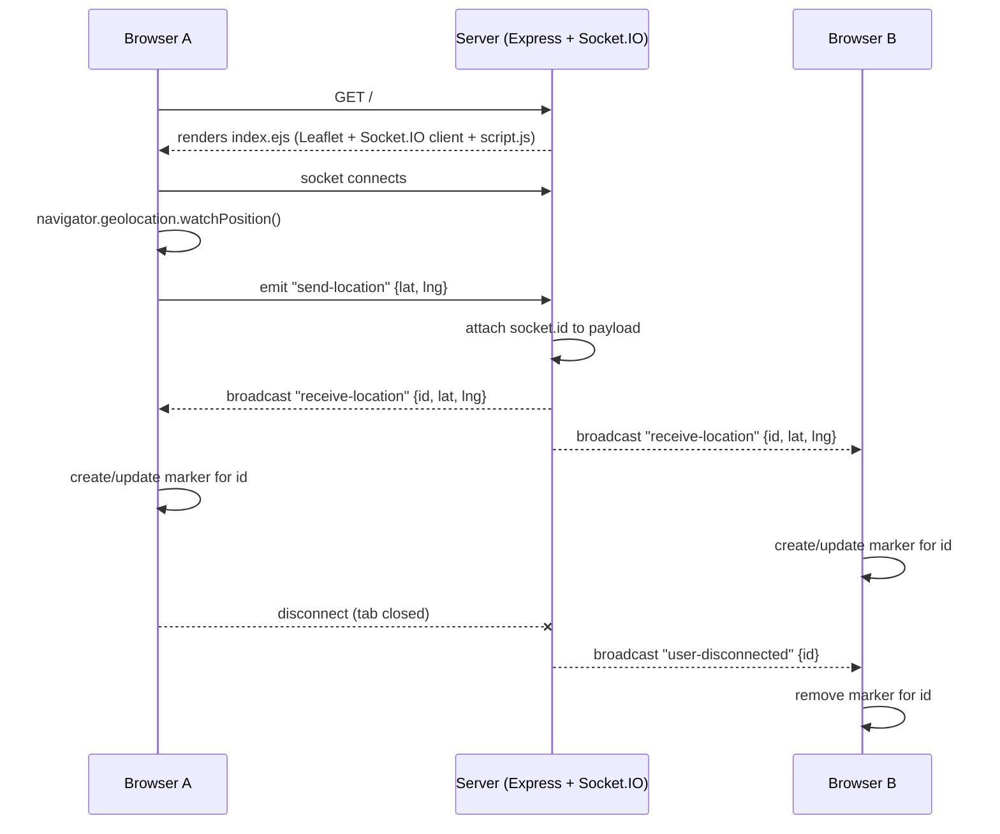
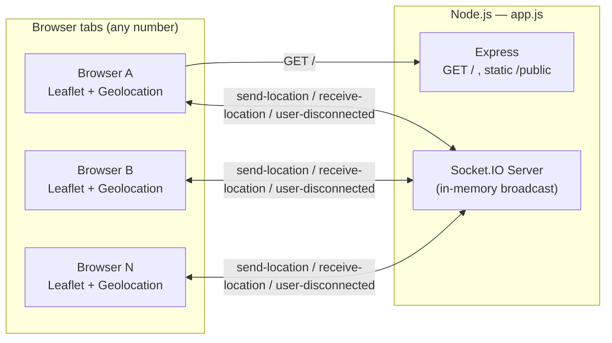

# Navora

**Real-time location sharing in the browser** — built with Node.js, Express, Socket.IO, and Leaflet.

Navora is a minimal, real-time location-tracking web app. Anyone who opens the page and grants location permission becomes a live marker on a shared map, visible to everyone else connected to the same server — no sign-up, no install, just a browser tab.


## Table of Contents

- [Overview](#overview)
- [Features](#features)
- [Tech Stack](#tech-stack)
- [How It Works](#how-it-works)
- [Project Structure](#project-structure)
- [Getting Started](#getting-started)
- [Socket.IO Event Reference](#socketio-event-reference)
- [Deployment Notes](#deployment-notes)
- [Known Issues and Limitations](#known-issues-and-limitations)
- [Roadmap](#roadmap)
- [Contributing](#contributing)
- [License](#license)
- [Acknowledgments](#acknowledgments)

## Overview

Navora renders a single full-screen map. When a user opens the page, the browser's Geolocation API starts streaming their coordinates to the server over a Socket.IO connection. The server rebroadcasts every location update to **all** connected clients, and each client plots (or moves) a marker for every other connected user. When someone disconnects, their marker disappears everywhere else. There is no database and no accounts — the "state" of the app is just whoever currently has the page open.

It's intentionally small: one server file, one HTML view, one client script. That makes it a good starting point for a group-location, ride-tracking, or "where is everyone" style feature.

## Features

- **Live broadcast** — browser geolocation is streamed to the server and rebroadcast to every connected client in real time via Socket.IO.
- **Shared interactive map** — Leaflet.js + OpenStreetMap tiles render one marker per connected user.
- **Automatic cleanup** — when a client disconnects, its marker is removed from every other client's map.
- **Zero install, zero account** — works from any modern browser tab, on desktop or mobile.
- **Tiny footprint** — no database, no build step, no framework overhead; the entire server is ~30 lines.

## Tech Stack

| Layer | Technology |
|---|---|
| Runtime | Node.js |
| Server framework | [Express](https://expressjs.com/) 5.x |
| Real-time transport | [Socket.IO](https://socket.io/) 4.x |
| View rendering | [EJS](https://ejs.co/) |
| Map / geolocation UI | [Leaflet.js](https://leafletjs.com/) 1.9 (via CDN) + [OpenStreetMap](https://www.openstreetmap.org/) tiles |
| Dev tooling | [nodemon](https://nodemon.io/) |

## How It Works

1. **Server boot** — `app.js` creates an Express app, wraps it in a raw `http.Server`, and attaches a Socket.IO server to that same HTTP server. Express serves exactly one route, `GET /`, which renders `views/index.ejs`; everything under `public/` is served as static files.
2. **Page load** — `index.ejs` loads Leaflet (JS + CSS) and the Socket.IO client from CDNs, then loads the app's own `public/js/script.js`.
3. **Client starts watching location** — `script.js` opens a Socket.IO connection and calls `navigator.geolocation.watchPosition(...)`, which prompts for permission and then keeps firing every time the device's coordinates change.
4. **Client emits location** — on every position update, the client emits a `send-location` event with `{ latitude, longitude }`. A Leaflet map is also created, initially centered at `[0, 0]`.
5. **Server rebroadcasts** — the server listens for `send-location` on each socket, attaches that socket's `id`, and re-emits it to **every** connected client as `receive-location`.
6. **Clients render markers** — every client's `script.js` listens for `receive-location`. If a marker already exists for that `id`, it's moved; otherwise a new marker is created. The map view is also recentered on whichever location update just arrived.
7. **Disconnect cleanup** — when a socket disconnects, the server broadcasts `user-disconnected` with that socket's `id`, and every remaining client removes the matching marker.

Because everything lives in memory on the socket connections, there's no persistence: restart the server, or have everyone leave, and the map is a blank slate again.





## Project Structure

```
Navora-backend-main/
├── app.js                  # Express + HTTP server + Socket.IO wiring, single "/" route
├── package.json             # Dependencies & metadata
├── package-lock.json
├── .gitignore
├── views/
│   └── index.ejs            # Single-page HTML shell (map container + script tags)
└── public/
    ├── css/
    │   └── style.css        # Full-viewport map styling
    └── js/
        └── script.js        # Client: geolocation watch, socket emit/listen, Leaflet markers
```

## Getting Started

### Prerequisites

- Node.js 18+ and npm
- A browser that supports the Geolocation API (all modern browsers do)
- HTTPS or `localhost` — browsers only expose geolocation on secure origins

### Installation

```bash
git clone <your-repo-url>
cd Navora-backend-main
npm install
```

### Running the app

The current `package.json` doesn't define `start`/`dev` scripts yet, so run the server directly:

```bash
# Run once
node app.js

# Run with auto-restart on file changes (nodemon is already a dependency)
npx nodemon app.js
```

Then open **http://localhost:3000** in one or more browser tabs (or on different devices on the same network) and allow the location-permission prompt. Each tab becomes a marker on every other tab's map.

> **Tip:** add these to `package.json` so you don't have to remember the raw commands:
> ```json
> "scripts": {
>   "start": "node app.js",
>   "dev": "nodemon app.js"
> }
> ```
> Then just run `npm start` or `npm run dev`.

### Configuration

There's no `.env`-driven configuration yet — the port is hardcoded in `app.js`:

```js
server.listen(3000);
```

`.env` is already listed in `.gitignore`, so the project is set up to support environment variables even though none are read today (see [Known Issues and Limitations](#known-issues-and-limitations)).

## Socket.IO Event Reference

| Event | Direction | Payload | Description |
|---|---|---|---|
| `send-location` | client → server | `{ latitude: number, longitude: number }` | Emitted every time the browser's geolocation watcher reports a new position. |
| `receive-location` | server → all clients | `{ id: string, latitude: number, longitude: number }` | Broadcast to everyone (including the sender) whenever any client sends a location. `id` is the emitting socket's `socket.id`. |
| `disconnect` | client → server *(built-in Socket.IO event)* | — | Fires automatically when a client's connection closes. |
| `user-disconnected` | server → all remaining clients | `id: string` | Broadcast so every client can remove the marker belonging to that socket id. |

## Deployment Notes

- **HTTPS is required.** The Geolocation API only works on secure origins (HTTPS, or `localhost` for local dev). Deploy behind TLS or a platform that terminates it for you.
- **Persistent connections.** Socket.IO needs a host that supports long-lived WebSocket connections (a VPS, Render, Railway, Fly.io, etc.). Some serverless platforms need extra configuration for WebSockets.
- **Third-party CDNs.** Leaflet, its CSS, the Socket.IO client, and the map tiles themselves are all pulled from public CDNs / OpenStreetMap. That's fine for development, but review the [OpenStreetMap tile usage policy](https://operations.osmfoundation.org/policies/tiles/) before higher-traffic production use, or switch to a dedicated tile provider (Mapbox, MapTiler, etc.).
- **Process management.** Nothing currently restarts the server if it crashes — add PM2, Docker with a restart policy, or rely on your platform's process supervisor.

## Known Issues and Limitations

These are things worth knowing (or fixing) before relying on this project beyond a demo:

1. **`package.json` entry point mismatch** — `"main"` points to `index.js`, but the actual server file is `app.js`.
2. **No `start`/`dev` scripts** — even though `nodemon` is already a declared dependency.
3. **Hardcoded port** — `server.listen(3000)` isn't configurable via an environment variable yet.
4. **`watchPosition` options aren't applied** — in `public/js/script.js`, the options object (`enableHighAccuracy`, `timeout`, `maximumAge`) is written *after* the closing parenthesis of the `watchPosition()` call, so it's never actually passed in. Geolocation currently runs with the browser's default accuracy/timeout behavior.
5. **CSS typo** — `public/css/style.css` has `width: :100%;` (an extra colon), which makes that declaration invalid and browsers ignore it.
6. **Map recenters on every update, from anyone** — `map.setView(...)` runs inside the `receive-location` handler for *every* broadcast, including other users' updates. In a multi-user session, the view will jump to whoever's update happened to arrive most recently rather than staying centered on the local user.
7. **No rooms or grouping** — every connected client sees every other client on one global map. There's no way to scope sharing to a specific group, trip, or session.
8. **No identity** — users are only distinguishable by an internal Socket.IO connection id; there's no display name, color, or avatar per marker.
9. **No persistence** — locations exist only for the lifetime of each connection; nothing is stored, so there's no history or reconnect recovery.
10. **No LICENSE file** in the repo, even though `package.json` declares `"license": "ISC"`.
11. **No automated tests** — the default `npm test` script just exits with an error.

None of this is a criticism of the current code — it's a compact proof of concept. The list above is meant as a practical starting checklist for hardening it.

## Roadmap

- [ ] Fix the `watchPosition` options bug, the CSS typo, and the "recenter on any update" behavior above.
- [ ] Add `start`/`dev` npm scripts and an `.env`-driven `PORT`.
- [ ] Add rooms (e.g., join via a shared link or code) so sharing can be scoped to a specific group instead of being global.
- [ ] Attach a user identity (name/color/avatar) to each marker.
- [ ] Persist recent locations (Redis/Mongo) to support reconnects and simple trails/history.
- [ ] Add an HTTPS-ready deployment setup (Docker + reverse proxy, or a platform like Render/Railway).
- [ ] Add basic integration tests for the socket event contract.

## Contributing

1. Fork the repo and create a feature branch: `git checkout -b feature/my-change`.
2. Make your changes and test locally with `npx nodemon app.js`.
3. Keep changes focused — small, reviewable PRs are easier to merge.
4. Open a pull request describing what changed and why.

## License

`package.json` declares this project as **ISC**. Add a `LICENSE` file at the repo root with the ISC license text to make that official and enforceable.

## Acknowledgments

- [Leaflet.js](https://leafletjs.com/) for the map rendering
- [OpenStreetMap](https://www.openstreetmap.org/copyright) contributors for map tile data
- [Socket.IO](https://socket.io/) for the real-time transport layer
